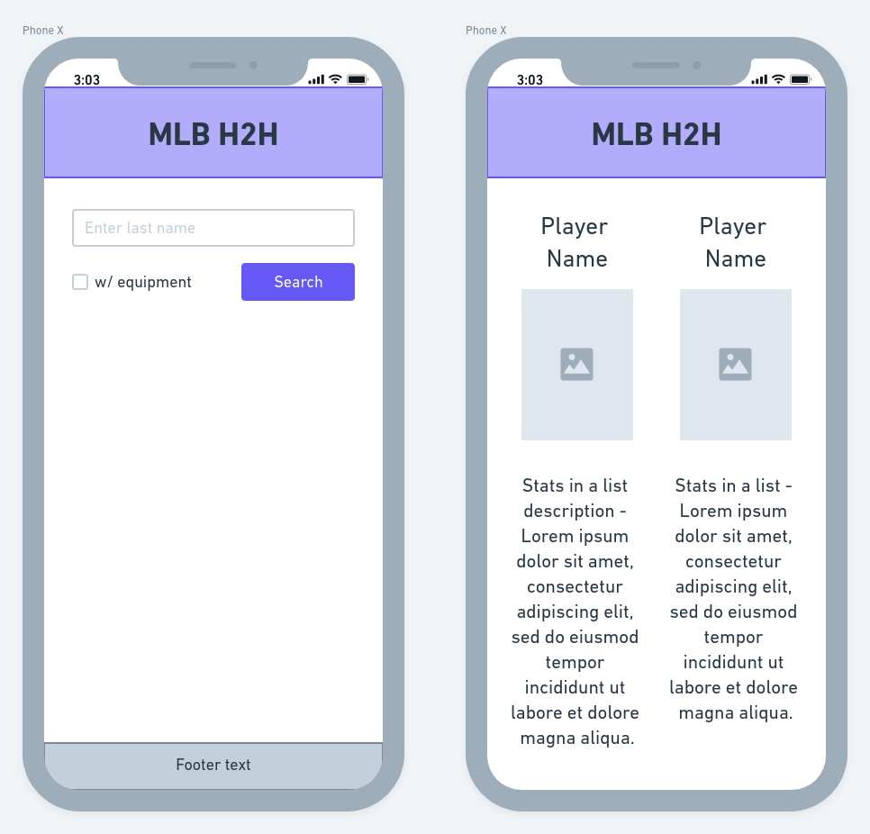
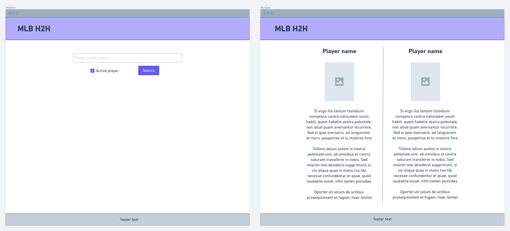

# MLB-H2H

## Description

MLB Head 2 Head is a web application with the intent to settle arguments between friends watching a baseball game. Designed for mobile first, a user can quickly reach in to their pocket mid-debate and search for two players to compare stats against. No more opening several tabs within the browser and bouncing between them to discuss and analyze key stats. The app will feature an easy to use interface, and a simple side to side comparison of two baseball players.

<br>

#### Wireframes




<br>

#### Component Hierarchy

```
mlb-h2h
|___ .storybook/
      |___ main.js

|___ public/
      |___ index.html

|___ src/

      |___ components/
            |___ Footer.js
            |___ Header.js
            |___ PlayerList.js
            |___ PlayerResult.js
            |___ PlayerStatCard.js
            |___ StatList.js

            |___  styles/
                  |___ Button.js
                  |___ Button.stories.js
                  |___ Checkbox.js
                  |___ Checkbox.stories.js
                  |___ ComparisonLayout.js
                  |___ ControlLayout.js
                  |___ Form.js
                  |___ GlobalStyle.js
                  |___ Main.js
                  |___ Message.js
                  |___ PlayerLayout.js
                  |___ SearchLayout.js
                  |___ Select.js
                  |___ Select.stories.js
                  |___ TeamLogo.js
                  |___ TextInput.js
                  |___ theme.js
                  |___ ToggleSwitch.js

      |___ pages/
            |___ PlayerComparison.js
            |___ PlayerSearch.js

      |___  utils/
            |___ filterStats.js
            |___ getBattingStats.js
            |___ getPitchingStats.js
            |___ getPlayerName.js
            |___ getYearInService.js
            |___ noBattingStats.json
            |___ noPitchingStats.json

      |___ App.js

      |___ index.js

|___ readme.md

```

<br>

#### Libraries

|      Library      | Description                       |
| :---------------: | :-------------------------------- |
|       axios       | _To make get requests to API_     |
|   framer-motion   | _Page transitions and animations_ |
| react-router-dom  | _Link and Route components_       |
|     storybook     | _Component library_               |
| styled-components | _For CSS in JS and global styles_ |
|   styled-reset    | _CSS reset._                      |

<br>

#### Data

|   API    | Quality Docs? | Website                                    | Sample Query                                                          |
| :------: | :-----------: | :----------------------------------------- | :-------------------------------------------------------------------- |
| MLB Data |      yes      | https://appac.github.io/mlb-data-api-docs/ | _http://lookup-service-prod.mlb.com/json/named.search_player_all.bam_ |

#### Runtime Notes (2026 refresh)

- The app now uses a Netlify Function proxy at `/.netlify/functions/mlb`.
- The proxy fetches MLB data from the modern Stats API (`https://statsapi.mlb.com/api/v1`) and normalizes responses for the UI.
- The frontend build tool is Vite.
- For local development, run through Netlify (`netlify dev`) so the function route is available, or set `VITE_API_BASE` to a reachable function URL.

<br>

#### MVP

The homepage will have a single text input field where the user can enter a players last name, check whether the player is active in the league, and click the search button. If only one player exists, then that player will be saved as the first player to compare, and their name and photo will appear on the left side of the page. If there are multiple players with the same last name, a list will appear and the user can select the specific player. One or both players can be removed from the screen and the user can search for a different player. Once both players are selected, the user can hit the compare button which will take them to the comparison page. Both of the players stats will be displayed side by side.

<br>

#### Post-MVP

- Debounce the search input so that PlayerList is rendered as user enters name.
- Page transitions and component animations using [Framer Motion](https://www.framer.com/motion/).
- Leaderboard bar displayed at the top of the homepage - shows current leaders in popular stats
- The ability to compare more players more players based on screen size.
